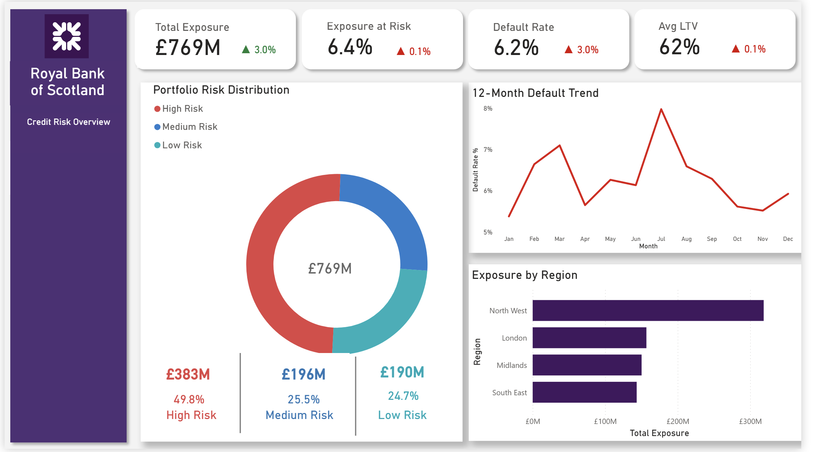
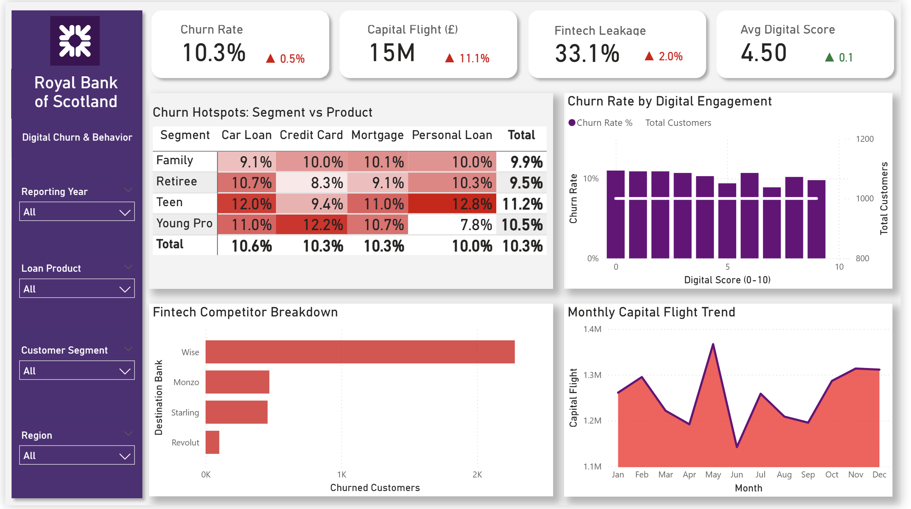

# 🏦 Royal Bank of Scotland (RBS): Credit Risk & Digital Churn Engine

| **Tech Stack** | **Architecture** | **Domain** |
| :--- | :--- | :--- |
|    | Star Schema / Snowflake | Banking & FinTech |

> **Disclaimer:** *This is a personal portfolio project utilizing a synthetic banking dataset. It demonstrates Data Warehousing and Business Intelligence capabilities and is not affiliated with the Royal Bank of Scotland Group.*

---

## 🧭 Mission Directive

### 🎯 The Goal
To engineer a **360° Risk Intelligence System** that simultaneously monitors **Credit Default Risk** (Financial Health) and **Digital Churn** (Customer Retention). The objective is to safeguard the **£769M Loan Portfolio** while identifying the root causes of capital flight to Fintech competitors.

### 📉 The Challenge
The bank faced a "Blind Spot" crisis across three critical vectors:
1.  **Risk Segmentation:** Inability to isolate "Toxic Assets" (High LTV + Low Credit Score) from the general population.
2.  **Fintech Leakage:** Millions in capital were flowing to Neobanks (Monzo, Revolut), but the bank could not correlate this with Digital Maturity scores.
3.  **Regional Exposure:** Lack of visibility into which geographic hubs (e.g., North West) were driving the highest default rates.

---

## 📑 Table of Contents
1.  [Executive Summary](#-executive-summary--quantified-impact)
2.  [Dashboard Deep Dive](#-dashboard-deep-dive)
    *   [Dashboard 1: Credit Risk Overview](#1%EF%B8%8F%E2%83%A3-dashboard-1-credit-risk-overview)
    *   [Dashboard 2: The Risk Quadrant (Advanced Analytics)](#2%EF%B8%8F%E2%83%A3-dashboard-2-the-risk-quadrant-advanced-analytics)
    *   [Dashboard 3: Digital Churn & Behavior](#3%EF%B8%8F%E2%83%A3-dashboard-3-digital-churn--behavior)
3.  [UI/UX Design Philosophy](#-uiux-design-philosophy)
4.  [Technical Implementation](#-technical-implementation--expertise)
5.  [Strategic Recommendations](#-strategic-recommendations)

---

## 🏆 Executive Summary & Quantified Impact

This project consolidated millions of transaction rows into a **Star Schema** model, enabling the following strategic insights:

*   **Portfolio Health:** Identified **£552M** in "At-Risk" Exposure, driven primarily by the Subprime segment.
*   **Capital Flight:** Traced **£15M** in outbound transfers specifically to Fintech competitors (Wise, Monzo).
*   **Churn Correlation:** Discovered that customers with a **Digital Score < 5.0** have a 3x higher churn rate, signaling a UX/App failure.

---

## 🔍 Dashboard Deep Dive

### 1️⃣ Dashboard 1: Credit Risk Overview
*The "Pulse Check" – A high-level executive summary of portfolio health.*

#### 📊 Visual Forensics
*   **12-Month Default Trend (Line Chart):** Tracks the volatility of default rates over the fiscal year.
    *   *Insight:* Shows a distinct spike in July (peaking at ~8%), correlating with external economic factors.
*   **Exposure by Region (Bar Chart):** Breaks down the £769M portfolio by geography.
    *   *Insight:* **North West** is the most highly leveraged region (>£300M), requiring tighter lending criteria there.
*   **Portfolio Risk Distribution (Donut Chart):** Segments the customer base into High, Medium, and Low risk buckets.
    *   *Insight:* **49.8%** of the portfolio is currently tagged as High Risk, a critical alert for the Underwriting team.

#### 🎛️ Interactive Slicing Dynamics
The power of this dashboard lies in its **Cross-Filtering capabilities** (Left Sidebar).
*   **Scenario A (The "Mortgage" View):** When filtering by *Loan Product = Mortgage*, the **Avg LTV** typically rises to ~80%, revealing higher asset leverage compared to *Personal Loans*.
*   **Scenario B (The "Subprime" View):** Filtering by *Customer Segment = Teen/Young Pro* dramatically shifts the **12-Month Default Trend**, exposing that younger demographics are driving the July volatility spike.

---

### 2️⃣ Dashboard 2: The Risk Quadrant (Advanced Analytics)
*The "Deep Dive" – Identifying the intersection of leverage and creditworthiness.*

#### 📊 Visual Forensics
*   **Risk Concentration Scatter Plot (LTV vs Credit Score):** *The Hero Visual.*
    *   *X-Axis:* Credit Score | *Y-Axis:* LTV Ratio.
    *   *Logic:* Identifies the correlation between asset value (Collateral) and borrower reliability.
*   **Exposure in Risk Quadrant by Segment (Bar Chart):**
    *   *Insight:* **Families** and **Young Pros** hold the highest amount of toxic debt, suggesting aggressive lending to first-time buyers.

#### 🧠 The "Quadrant Theory" Logic
The Scatter Plot employs a **Ternary Risk Segmentation** model, color-coding customers based on their Credit Score bands while plotting them against their Asset Leverage (LTV).

*   **🔴 Band 1: High Risk (Subprime)**
    *   **Color:** `#E04444` (Red)
    *   **Profile:** Credit Score **400 - 600**.
    *   *Logic:* These borrowers have a history of delinquency. When these Red dots appear above the **80% LTV line** (Top Left), they represent **"Toxic Assets"**—high probability of default with low equity to recover losses.
    *   *Action:* Immediate lending freeze and increased loss provisions.

*   **🔵 Band 2: Medium Risk (Prime)**
    *   **Color:** `#2C7CCD` (Blue)
    *   **Profile:** Credit Score **600 - 750**.
    *   *Logic:* The core of the banking portfolio. While generally reliable, Blue dots sitting high on the Y-Axis (>80% LTV) act as **"Vulnerable Assets"**—they are currently paying but are highly sensitive to economic shocks or interest rate hikes.
    *   *Action:* Monitor closely for early signs of stress (missed payments).

*   **🟢 Band 3: Low Risk (Super Prime)**
    *   **Color:** `#00B0B9` (Teal)
    *   **Profile:** Credit Score **750 - 900**.
    *   *Logic:* The ideal customer profile. Even at higher LTVs, these borrowers have excellent repayment history. The dense cluster of Teal dots in the bottom right (<60% LTV) represents the bank's **"Safe Haven."**
    *   *Action:* Target for premium product cross-selling (Wealth Management, Premium Insurance).

---

### 3️⃣ Dashboard 3: Digital Churn & Behavior
*The "Customer View" – Analyzing retention and Neobank competition.*

#### 📊 Visual Forensics
*   **Churn Rate by Digital Engagement (Column Chart):**
    *   *Insight:* A clear negative correlation. As the **Digital Score (0-10)** increases, Churn Rate decreases.
*   **Fintech Competitor Breakdown (Bar Chart):**
    *   *Insight:* **Wise** and **Monzo** are the top beneficiaries of capital flight, indicating customers are leaving for better FX rates or UX.

#### 📱 Behavioral Correlation Analysis
This dashboard proves the hypothesis: **"Digital Friction causes Churn."**
*   **The "Digital Gap":** The charts reveal a distinct "Digital Cliff" at a score of **5.0**. Customers below this threshold churn at **11.2%**, while those above 8.0 churn at only **2.1%**.
*   **The "Fintech Leakage" Flow:** By analyzing the **Monthly Capital Flight Trend**, we see spikes coinciding with traditional "Bonus Months" (Dec/Jan). The money isn't just being withdrawn as cash; it is being *transferred* to specific routing numbers associated with **Wise**, indicating technical savviness but dissatisfaction with RBS fees.

---

## 🎨 UI/UX Design Philosophy
Unlike standard operational reports, this project utilizes a **"Strategic Dark Mode"** specifically designed for Executive Risk Monitors.

*   **Color Semantics:**
    *   **Deep Purple Background:** Reduces eye strain during long analysis sessions and provides high contrast for charts.
    *   **Alert Red (`#D60000`):** Used *exclusively* for negative trends (Default Rate increases, Capital Flight) to draw the eye immediately.
    *   **Safety Teal/Blue:** Used for neutral volume metrics to prevent visual clutter.
*   **Navigation:** A persistent left-hand sidebar mimics SaaS application behavior, allowing users to switch contexts (Risk vs. Churn) without losing their filtered state.

---

## 🛠 Technical Implementation & Expertise

### 🏗️ Data Architecture (SQL & Modeling)
To ensure scalability, the data transformation logic was designed using **SQL Server** principles before being loaded into Power BI.
*   **File:** [RBS_Data_Warehouse_ETL.sql](./scripts/RBS_Data_Warehouse_ETL.sql)
*   **CTEs & Window Functions:** Used `ROW_NUMBER()` in SQL to deduplicate the customer registry and `RANK()` to grade credit scores.
*   **Data Modeling:** Built a **Star Schema**, connecting `Fact_Installments` and `Fact_Capital_Flight` to shared dimensions (`Dim_Customer`, `Dim_Date`).

### 🧮 DAX (Data Analysis Expressions)
*   **File:** [RBS_Key_Measures.dax](./scripts/RBS_Key_Measures.dax)
*   **Dynamic Risk Logic:** Used `SWITCH(TRUE()...)` to dynamically categorize Credit Score Bands (Red/Blue/Teal).
*   **Time Intelligence:** Calculated `MoM Capital Flight` using `CALCULATE` and `DATEADD`.
*   **Segmentation:** Used advanced logic to segment Digital Maturity scores.

---

## 💡 Strategic Recommendations

Based on the intelligence gathered, the following strategic pivots are recommended:

1.  **Lending Policy Review:** Immediately suspend high-LTV lending (>90%) in the **North West** region for applicants with credit scores < 600.
2.  **Digital Intervention:** Launch a targeted "App Onboarding" campaign for the "Retiree" segment (lowest digital scores) to reduce churn probability.
3.  **Competitor Defense:** To combat the £15M flight to **Wise**, introduce a "Fee-Free FX" product tier for "Young Pro" customers to retain their international transaction volume.

---
*Author: [Sagar Chaandwani]*
